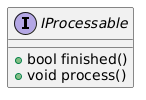

# Interface *IProcessable*
This repo consists of an interface component *IProcessable*. It is part of example application *[broker](https://github.com/slawomir-niespodziany/diff_broker)* which demonstrates use of the *[diff](https://github.com/slawomir-niespodziany/diff)* framework. 

*IProcessable* is further implemented by components which need to be processed to perform internal actions. 
See broker repo for more details.

<p align="center"></p>

## Installation
*It is recommended to build and run the whole demo app at once, by following the guide in *[broker](https://github.com/slawomir-niespodziany/diff_broker)* repo. If you only want to install this single component, then proceed with this document.*

This is an interface component. It consists only of header files, thus it needs not to be built. However, it shall be installed, so other components, which depend on it, may include those headers.

Below command can be run from within the component directory to install the component in your local (user-wide, not system-wide) CMake registry.
```
cmake -Bbuild -DCMAKE_EXPORT_PACKAGE_REGISTRY=ON
```

## Prerequisites
The whole demo is prepared and tested under Ubuntu 22.04 and Ubuntu 24.04. With that being said, you shall only need *cmake* to perform installation of this component. The newest version (*cmake 4.0.1*) is available under the following command.
```
sudo snap install cmake
```
